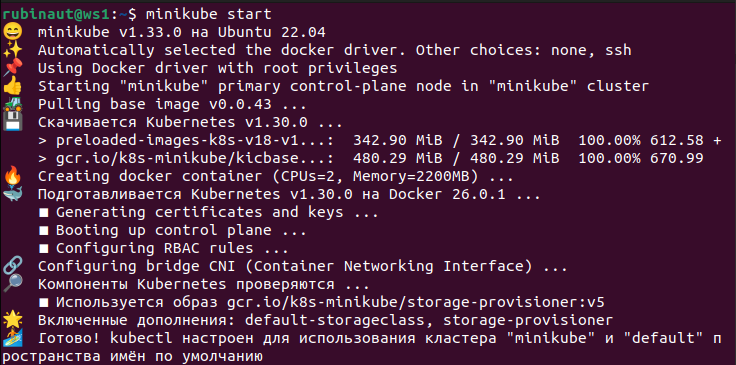

# Тестовое задание в СБЕР

### Развернул minikube

```
sudo apt-get update
sudo apt-get install curl
curl -Lo minikube https://storage.googleapis.com/minikube/releases/latest/minikube-linux-amd64
chmod +x minikube
sudo mv minikube /usr/local/bin/
minikube start
minikube dashboard
```
`minikube stop` - остановка миникуба 



### Написал Helm чарт, который устанавливает последнюю версию. Nginx доступен по порту 32080 на ноде Kubernetes.

- Установил `helm`

```
1. Скачал нужную версию
2. Распакуйте её (tar -zxvf helm-v3.0.0-linux-amd64.tar.gz)
3. Найдите `helm binary` файл в директории из распаковки, и переместите в нужное место (mv linux-amd64/helm /usr/local/bin/helm)
```
Написал: `templates/deployment.yaml`, `Chart.yaml`, `values.yaml`

- helm install nginx-release ./nginx-chart

- minikube dashboard 

### Развернул Jenkins в Minikube

- Добавил репозиторий helm для Jenkins

```
  helm repo add jenkins https://charts.jenkins.io
  helm repo update
```
- Установил Jenkins

```
  helm install jenkins-release jenkins/jenkins \
  --set controller.serviceType=NodePort \
  --set controller.admin.password=passworddd5
```
- Получил информацию о Jenkins 

```
kubectl get svc jenkins-release -o jsonpath='{.spec.ports[0].nodePort}'
```

### Написал Jenkins Job, который устанавливает написанный чарт для установки Nginx на кластер Minikube.

- В файле Jenkinsfile

### В Git репозиторий добавил Helm чарт

```
git add .
git commit -m "1"
git push
```

### В Git репозиторий добавил файл Readme.md, где описал процесс запуска Minikube с Jenkins и процесс создания Job для Nginx

### THE END


- Всю работу проделал сам , пользуясь CHATGPT и ресурсами из инетрнета. Базовых знаний по Kubernetes и Jenkins не было , но огромное желание выйти на стажировку/джуном в Сбер, заставило меня не покладая рук заниматься. Нужен шанс, благодаря которому я прокачаю свой стэк (DevOps) и докажу что способен быстро обучаться (на основе чего и построено моё обучение в Школе 21 - от СБЕР). Спасибо!
