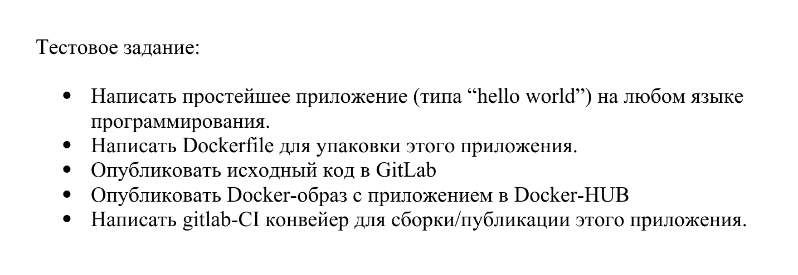
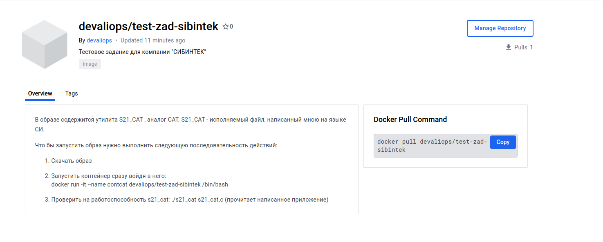
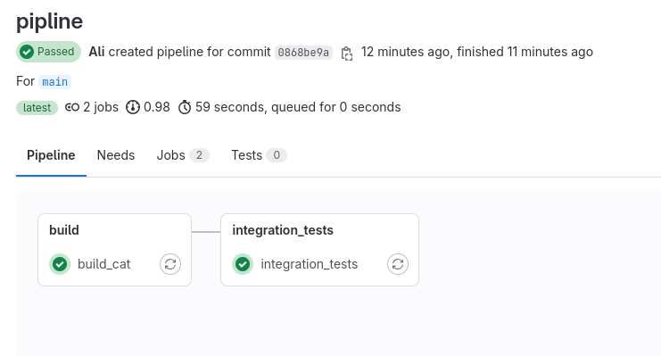

# Тестовое задание - СИБИНТЕК

## Задание:

### Последовательность действий:

- Написал свою утилиту s21_cat на языке СИ , так же Makefile и UNIT-тесты.

- Написал Dockerfile для упаковки приложения 

- Опубликовал исходный код в Гитлаб

- Опубликовал Dockerfile в Docker Hub

- Написал CI/CD конвейер для сборки и проверки на тесты, приложения.

` Продолжительность работы - 4 часа `
` Спасибо за внимание , может работа отличается от ТЗ, но не судите строго , хотел как-то разнообразить )`

`MADE IN DevAliOps `